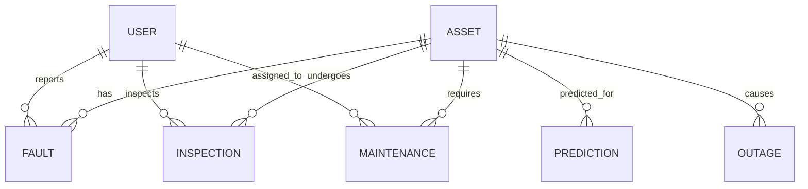

# PowerPulse AI — Phase 1 Implementation Plan

## Overview

Build the complete foundation of **PowerPulse AI**, a Smart Utility Asset Intelligence Platform for TPCODL (Tata Power Central Odisha Distribution Limited). Phase 1 delivers:

- Full Spring Boot 3 backend with JPA entities, JWT auth, and role-based security
- React frontend with the **Tata Power Dark Grid** design system — animated, deployment-ready
- Python ML service skeleton with FastAPI
- Docker + docker-compose for one-command deployment

> [!IMPORTANT]
> **Design System**: All UI follows the "Tata Power Dark Grid" — dark surfaces (#121212/#0B0F0D), electric green accent (#03FFAB), Syne + Outfit typography, angular shapes, minimal shadows, generous spacing. No glassmorphism, no pill buttons, no bubbly cards.

---

## Proposed Changes

### 1. Spring Boot Backend (`/backend`)

#### [NEW] Project Structure

```
backend/
├── pom.xml
├── Dockerfile
├── src/main/java/com/tpcodl/powerpulse/
│   ├── PowerPulseApplication.java
│   ├── config/
│   │   ├── SecurityConfig.java          # Spring Security filter chain, role-based access
│   │   ├── JwtAuthenticationFilter.java # OncePerRequestFilter for JWT validation
│   │   ├── JwtTokenProvider.java        # JWT token generation + validation
│   │   ├── CorsConfig.java             # CORS for React frontend
│   │   └── AppConfig.java              # Password encoder, RestTemplate beans
│   ├── entity/
│   │   ├── User.java                   # id, username, email, password, role, fullName, phone, zone
│   │   ├── Asset.java                  # assetId (TR-1001), type, location, lat/lng, status, zone
│   │   ├── Fault.java                  # faultId, asset FK, severity, type, reportedBy, resolvedAt
│   │   ├── Maintenance.java            # maintenanceId, asset FK, type (preventive/corrective), scheduledDate
│   │   ├── Inspection.java             # inspectionId, asset FK, inspector FK, findings, score
│   │   ├── Prediction.java             # predictionId, asset FK, failureProbability, predictedDate, model
│   │   ├── Inventory.java              # inventoryId, itemName, category, quantity, warehouse, reorderLevel
│   │   └── Outage.java                 # outageId, zone, affectedCustomers, startTime, endTime, cause
│   ├── enums/
│   │   ├── Role.java                   # ADMIN, FIELD_ENGINEER, MAINTENANCE_MANAGER, EXECUTIVE
│   │   ├── AssetType.java              # TRANSFORMER, FEEDER, POLE, METER, SWITCHGEAR, CABLE
│   │   ├── AssetStatus.java            # OPERATIONAL, DEGRADED, FAULTY, DECOMMISSIONED
│   │   ├── FaultSeverity.java          # LOW, MEDIUM, HIGH, CRITICAL
│   │   ├── MaintenanceType.java        # PREVENTIVE, CORRECTIVE, EMERGENCY, PREDICTIVE
│   │   └── MaintenanceStatus.java      # SCHEDULED, IN_PROGRESS, COMPLETED, OVERDUE
│   ├── repository/                     # JpaRepository interfaces for each entity
│   ├── dto/
│   │   ├── LoginRequest.java
│   │   ├── LoginResponse.java
│   │   ├── RegisterRequest.java
│   │   └── ApiResponse.java
│   ├── service/
│   │   └── CustomUserDetailsService.java  # UserDetailsService implementation
│   └── exception/
│       ├── GlobalExceptionHandler.java
│       └── ResourceNotFoundException.java
├── src/main/resources/
│   ├── application.properties          # MySQL, JWT, FastAPI config
│   └── schema.sql                      # Complete CREATE TABLE statements
└── src/test/java/com/tpcodl/powerpulse/
    └── PowerPulseApplicationTests.java
```

#### Entity Relationships



#### Key Design Decisions (Backend)

- **Asset IDs**: String format — `TR-1001` (transformer), `FD-2003` (feeder), `PL-3045` (pole)
- **Zones**: TPCODL Odisha zones — Bhubaneswar, Cuttack, Berhampur, Sambalpur, Rourkela, Balasore
- **Audit fields**: All entities have `createdAt`, `updatedAt` with `@CreatedDate`
- **Soft delete**: `isActive` flag on Asset and User — no hard deletes
- **Coordinates**: `latitude`/`longitude` as `Double` for Leaflet map integration

---

### 2. React Frontend (`/frontend`)

#### [NEW] Project Structure (Vite + React + TailwindCSS)

```
frontend/
├── Dockerfile
├── nginx.conf                    # Production Nginx config
├── package.json
├── tailwind.config.js            # Tata Power Dark Grid design tokens
├── vite.config.js
├── index.html
├── public/
│   └── favicon.svg
└── src/
    ├── main.jsx
    ├── App.jsx                   # Router setup with animated transitions
    ├── index.css                 # Global styles, @font-face, animations
    ├── assets/                   # Static images (reference photos)
    ├── components/
    │   ├── layout/
    │   │   ├── Sidebar.jsx       # Animated sidebar with role-based nav
    │   │   ├── Header.jsx        # Top bar with notifications, user avatar
    │   │   └── DashboardLayout.jsx
    │   ├── ui/
    │   │   ├── Button.jsx        # Matches design.md button specs
    │   │   ├── Card.jsx          # Dark bordered cards, 8px radius
    │   │   ├── Input.jsx         # Dark surface, square-edged
    │   │   ├── Badge.jsx         # Status chips with accent colors
    │   │   ├── LoadingSpinner.jsx # Animated electric pulse loader
    │   │   ├── AnimatedCounter.jsx # Count-up animation for stats
    │   │   └── GlowEffect.jsx     # Subtle electric green glow
    │   ├── charts/
    │   │   ├── AssetHealthChart.jsx    # Doughnut chart — asset status
    │   │   ├── FaultTrendChart.jsx     # Line chart — faults over time
    │   │   ├── MaintenanceBarChart.jsx # Bar chart — maintenance by type
    │   │   └── OutageTimeline.jsx      # Timeline visualization
    │   └── maps/
    │       └── AssetMap.jsx       # Leaflet map with custom dark tiles + markers
    ├── pages/
    │   ├── LoginPage.jsx          # Full-screen dark login with animations
    │   ├── DashboardPage.jsx      # KPI cards, charts, map, activity feed
    │   ├── AssetsPage.jsx         # Asset table with filters and search
    │   ├── FaultsPage.jsx         # Fault log with severity badges
    │   ├── MaintenancePage.jsx    # Maintenance scheduler
    │   ├── MapViewPage.jsx        # Full-screen Leaflet map
    │   ├── PredictionsPage.jsx    # ML predictions dashboard
    │   └── NotFoundPage.jsx       # Animated 404
    ├── hooks/
    │   ├── useAuth.js             # JWT auth context hook
    │   └── useApi.js              # Axios wrapper with interceptors
    ├── context/
    │   └── AuthContext.jsx        # Auth state management
    ├── services/
    │   └── api.js                 # Axios instance with base URL + JWT
    └── utils/
        └── constants.js           # API URLs, roles, asset types
```

#### Frontend Animations & UX (Key Features)

| Feature | Implementation |
|---|---|
| Page transitions | Framer Motion `AnimatePresence` with slide/fade |
| Sidebar | Collapsible with smooth width transition, icon tooltips |
| KPI counters | Count-up animation from 0 to value on mount |
| Chart loading | Skeleton pulse → chart fade-in |
| Map markers | Custom SVG markers with pulse animation for active faults |
| Login page | Particle grid background with electric pulse effect |
| Cards | Subtle border-glow on hover (#03FFAB at 20% opacity) |
| Notifications | Slide-in toast with auto-dismiss |
| Data tables | Row hover highlight, staggered row entrance |
| Loading states | Custom "PowerPulse" spinner with rotating electricity icon |

#### Design Token Mapping (Tailwind Config)

```js
// From design.md → tailwind.config.js
colors: {
  primary: '#03FFAB',      // Electric green
  secondary: '#F8F5EC',    // Warm off-white
  tertiary: '#8FE7C9',     // Soft mint
  neutral: '#121212',      // Dark canvas
  surface: '#0B0F0D',      // Deep black
  'on-surface': '#F8F5EC', // Text on dark
  error: '#FF6B6B',        // Alert red
  border: '#374151',       // Cool border
  'text-muted': '#B8B2A6', // Muted text
  overlay: '#011210',      // Teal-black
}
fontFamily: {
  syne: ['Syne', 'sans-serif'],
  outfit: ['Outfit', 'sans-serif'],
}
```

---

### 3. Python ML Service (`/ml-service`)

#### [NEW] Skeleton Structure

```
ml-service/
├── Dockerfile
├── requirements.txt
├── main.py                 # FastAPI app with health check
├── models/
│   └── predictor.py        # XGBoost model placeholder
└── utils/
    └── data_processor.py   # Pandas data pipeline
```

> [!NOTE]
> The ML service in Phase 1 is a skeleton — it runs, has a health check, and returns mock predictions. Full ML training comes in Phase 3.

---

### 4. Docker & Deployment (`/`)

#### [NEW] Root-Level Files

```
TPCODL_Project/
├── docker-compose.yml      # MySQL + Backend + Frontend + ML Service
├── .env                    # Environment variables (DB password, JWT secret)
├── .gitignore
└── README.md               # Setup instructions
```

#### docker-compose Services

| Service | Image | Port | Notes |
|---|---|---|---|
| `mysql-db` | mysql:8.0 | 3306 | Volume-mounted data |
| `backend` | Custom (Maven) | 8080 | Depends on mysql-db |
| `frontend` | Custom (Nginx) | 3000 | Nginx reverse proxy |
| `ml-service` | Custom (Python) | 8000 | FastAPI |

---

## Verification Plan

### Automated Tests
- `mvn clean compile` — Backend compiles without errors
- `npm run build` — Frontend builds for production
- `docker-compose config` — Validates compose file

### Manual Verification
- MySQL schema loads correctly with `schema.sql`
- JWT login flow works end-to-end
- Frontend renders the Dark Grid design with all animations
- All entities have correct JPA mappings and relationships
- Docker compose starts all 4 services cleanly

---

## Open Questions

> [!IMPORTANT]
> **MySQL Credentials**: I'll use `powerpulse_admin` / `TpCoDL@2026!` as defaults in `application.properties` and `.env`. Should I change these?

> [!NOTE]
> **TPCODL Zone Names**: I'll use real Odisha distribution zones (Bhubaneswar, Cuttack, Berhampur, Sambalpur, Rourkela, Balasore) plus your example "Moradabad Sector-5" in sample data. Confirm if you want Odisha-only or mixed.

---

## Scope Boundaries

Phase 1 delivers **structure + security + design**. The following are explicitly **NOT in Phase 1**:
- REST API controllers and service layer logic (Phase 2)
- ML model training and inference (Phase 3)
- WebSocket real-time updates (Phase 4)
- Production CI/CD pipeline
